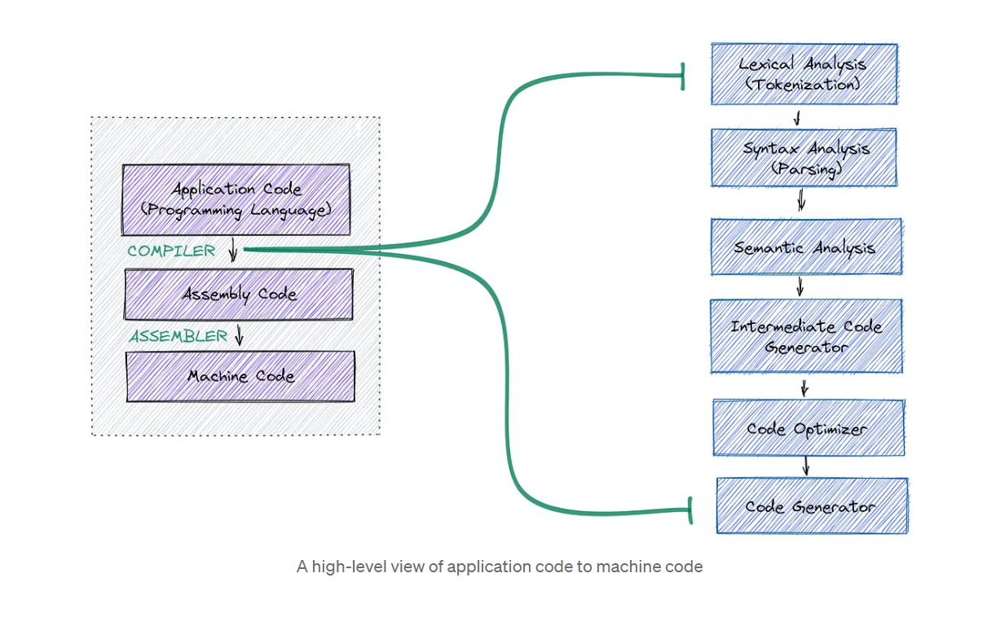
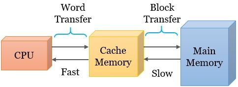

# Volatile in C
## How do compilers work ?
### References:
- https://medium.com/skydome-academy/how-do-compilers-work-8a1ffddf0667
  

    

### Example: Optimize code 
~~~cpp
#include <stdio.h>

int main() {
    int x = 10;
    int y = 20;
    
    if (x > y) {
        printf("x is greater than y.\n");
    } else {
        printf("x is not greater than y.\n");
    }
    return 0;
}
Output: x is not greater than y.
~~~
Đoạn chương trình chỉ xảy ra ở `else` và không xảy ra ở phần `if(x > y)` được nên `compiler` sẽ tự động xóa đi đoạn code if(x > y) để tối ưu `tốc độ` và `bộ nhớ`.

## What is a Volatile Keyword in C ?
- Keywords `Volatile` nó thông báo cho `compiler` biết là giá trị của biến có thể thay đổi bất cứ lúc nào, ngăn chặn việc `tối ưu` hóa chương trình của compiler. 
=> Khi sử dụng từ khóa `volatile` trong C, để đảm bảo rằng `compiler` sẽ không tối ưu hóa việc truy cập vào biến đó, luôn được đọc và ghi trực tiếp từ `memory`.

    

## Syntax
- To `declare a variable volatile`, include the keyword volatile before or after the data type in the variable definition.
~~~cpp
volatile int foo;
int volatile foo;

volatile int * foo;
int volatile * foo;

int * volatile foo;

int volatile * volatile foo;
~~~

## When To Use Volatile in C/C++ ?
- Memory-mapped peripheral registers.
- Global variables modified by an interrupt service routine.
- Global variables within a multi-threaded application.

## Example
- ***Example 1:***  
Giả sử, bạn đang phát triển một ứng dụng điều khiển một cảm biến nhiệt độ. Cảm biến này liên tục gửi dữ liệu về nhiệt độ đo được tới biến trong mã của bạn. Bạn muốn chắc chắn rằng dữ liệu nhiệt độ luôn được cập nhật chính xác trong biến, ngay cả khi compiler có thể thực hiện các tối ưu hóa `(optimizations)`.
~~~cpp
#include <stdio.h>
#include <stdbool.h>

volatile int temperature; // Biến nhiệt độ

void readTemperatureFromSensor() {
    // Giả định hàm này đọc dữ liệu nhiệt độ từ cảm biến và gán vào biến temperature
    // Vì nó thay đổi từ bên ngoài, nên chúng ta sử dụng volatile để đảm bảo tính nhất quán.
    temperature = /* ... */;
}

int main() {
    while (true) {
        readTemperatureFromSensor();
        printf("Current temperature: %d\n", temperature);
    }
    return 0;
}
~~~
`NOTE`: Nếu không sử dụng `volatile`, trình biên dịch có thể tối ưu hóa và giữ giá trị nhiệt độ trong `thanh ghi CPU` hoặc `cache`, không cập nhật giá trị liên tục từ cảm biến.

- ***Example 2:*** Memory-mapped peripheral registers. 
  Giả sử, ta đang viết mã cho một vi điều khiển nhúng và  muốn đọc giá trị từ thanh ghi ngoại vi điều khiển nút nhấn (button) để biết xem nút đã được nhấn hay chưa.
~~~cpp
#include <stdio.h>

volatile unsigned int *button_register = (volatile unsigned int *)0x20000000;

int main() {
    while (1) {
        if (*button_register & 0x01) {
            // Nếu bit thấp nhất của thanh ghi bằng 1, tức là nút đã được nhấn.
            // Thực hiện các hành động tương ứng ở đây.
        }
    }
    return 0;
}
~~~
`NOTE:` Nếu không sử dụng `Volatile`, compiler có thể quyết định tối ưu hóa việc truy cập đến biến này bằng cách `lưu trữ giá trị` của biến trong `thanh ghi CPU` và `bộ nhớ cache` thay vì đọc giá trị từ bộ nhớ thực sự => dẫn tới kết quả không mong muốn.

